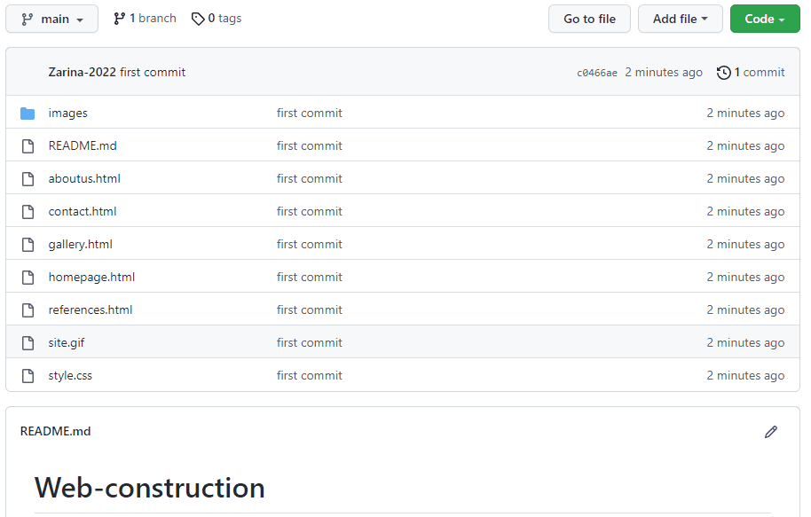

# Web-construction

<h1> This is a five page web design project.</h1>

<h3>The screen view:</h3>

<h3>This site was made using only HTML and CSS.</h3>

<h3> Here, a magnificent visuality has been achieved by  

using hover and other features on tags such as button, image, title, paragraf, div.</h3>

<h3> And also, different page arrangements were made. And in addition,  

maps and icons from Google were added.</h3>

<h3> I will continue to renew this project as I develop my CSS, HTML and Java Script.  </h3>

<h2> How to install and run the project. </h2>

Do share your valuable opinion, I appreciate your honest  

Enjoy Coding ❤

